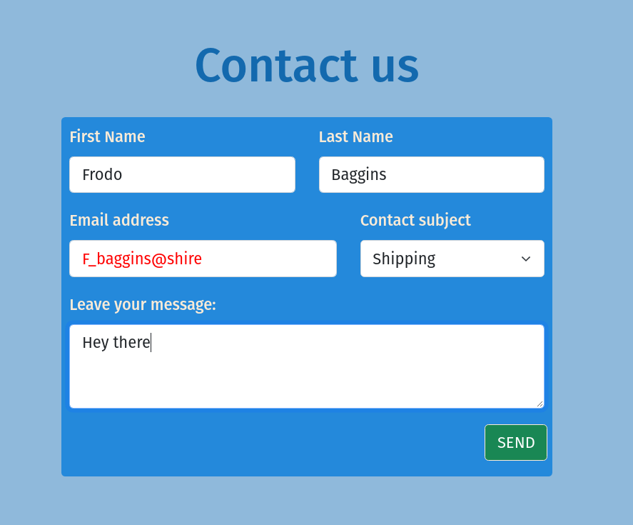
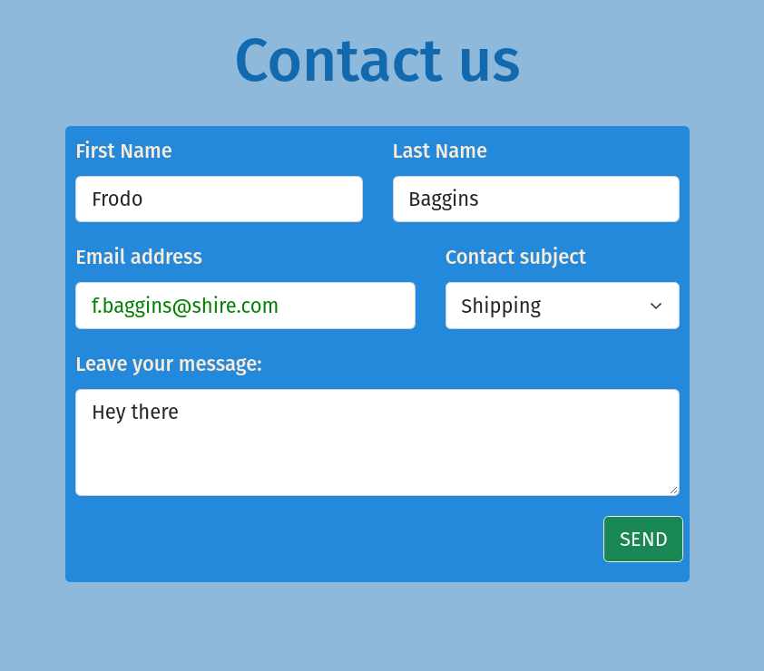
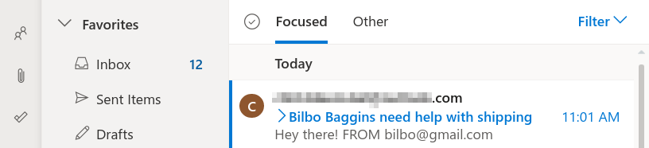

# Contact Form

### Screen Shots
#### Client side basic email validation while typing
 
#### E-mail recived at the email box


---

## Description

- A simple contact form that sends an email! 

- The form data is fetched from the client-side to the server-side, which is responsible for actually sending the email

- Alerts user if the email was sent or if an error occurred during the email sending or the communication with the server

- Project has basic server and client side validation and sanitization


#### Technologies applied

- Node.js
- Express
- Express-validator
- Nodemailer

---
### What I Learned:
- Create GET and POST requests;
- Set up basic routes;
- Communication between the backend and front-end through the fetch method;
- work with asynchronous functions (async/await and promises).


---

## How To Use

- Clone the project and provide a valid service, email-user and password at senEmail.js:
```JS
const transporterOptions = {
      service: "outlook",
      auth: {
        user: process.env.EMAIL,
        pass: process.env.EMAILSECRET,
      }
    }
```

---

## Author Info

- Website - [LinkedIn: Bruno G Campos](https://www.linkedin.com/in/bruno-galv%C3%A3o-de-campos-b67325133/)

- [Back To The Top](#contact-form)

